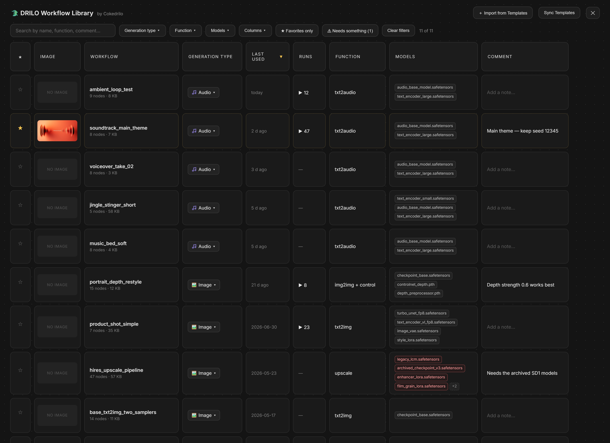
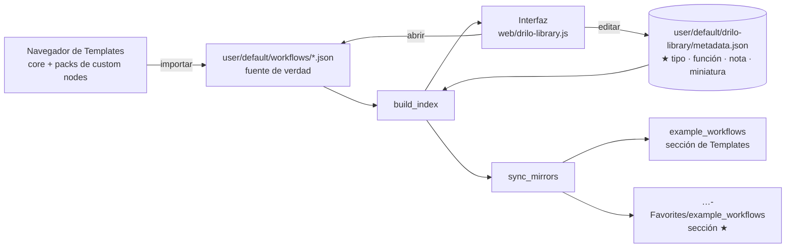

# 🐊 DRILO Workflow Library

[English](README.md) · **Español**

Un custom node de ComfyUI que **no aporta ningún nodo**. Existe para que *elegir
en qué workflow vas a trabajar* sea una decisión visual y no adivinar por el
nombre de un archivo.



1. **Una biblioteca visual**: una tabla con miniatura, tipo de generación, último
   uso, función, modelos necesarios y notas — filtrable, ordenable y editable en
   línea. Se abre con el botón ★ *Library* de la barra lateral de iconos, con
   `Ctrl+Shift+B`, o desde el menú Workflow. `Ctrl+Shift+K` **no** funciona:
   ComfyUI ya lo tiene asignado a `Workspace.ToggleBottomPanel.Shortcuts`.
2. **Una sección propia en el navegador de Templates.** ComfyUI construye ese
   menú haciendo glob sobre `custom_nodes/*/example_workflows/*.json`, así que la
   carpeta `example_workflows` de este paquete aparece como una sección, y una
   carpeta hermana `…-Favorites` hace lo mismo con los workflows marcados.

> La interfaz del programa está en inglés. Esta traducción cubre solo la
> documentación.

## Instalación

Clona dentro de `ComfyUI/custom_nodes/` y reinicia ComfyUI:

```bash
git clone https://github.com/cokedrilo/ComfyUI-DRILO-Workflow-Library
```

Necesita Pillow, que ya viene con ComfyUI. En el primer arranque el paquete crea
una carpeta hermana, `<carpeta-de-instalación>-Favorites`, que sostiene la
sección ⭐ de Templates — **esa sección solo aparece tras el siguiente reinicio**,
porque ComfyUI registra las rutas de los custom nodes al arrancar.

> **Nota de seguridad.** ComfyUI no tiene autenticación. Este paquete añade
> endpoints que renombran, duplican, importan y borran archivos de workflow, así
> que si ejecutas ComfyUI con `--listen`, cualquiera que alcance el puerto puede
> invocarlos. Borrar mueve los archivos a una papelera en lugar de eliminarlos,
> pero no expongas una instancia desprotegida a una red en la que no confíes.

## Dónde viven tus datos

Nada generado por el usuario se guarda dentro del paquete — ComfyUI-Manager borra
y reinstala las carpetas de custom nodes al actualizarlas. Los metadatos, las
miniaturas y la papelera viven en `user/default/drilo-library/`, junto a tus
workflows. Los datos escritos por versiones anteriores se migran allí
automáticamente en el primer arranque.

## Flujo de datos



Los workflows nunca se editan a través de una copia: la biblioteca abre el
archivo real, así que `Ctrl+S` guarda sobre el original. Las dos carpetas
`example_workflows` son **espejos regenerables** — se vacían en cada
sincronización, así que no las edites.

## Columnas

| Columna | Notas |
| --- | --- |
| ★ | Marcar favorito también regenera la sección ⭐ de Templates |
| Image | Clic para abrir · arrastra una imagen encima para poner miniatura |
| Workflow | Editable — renombra el archivo real. No se puede ocultar |
| Generation type | Inferido de los nodos, editable |
| Last used | Se actualiza cada vez que abres el workflow desde aquí |
| Runs | Cuántas veces se ha ejecutado de verdad, no solo abierto |
| Function | Inferida (txt2img, inpaint, upscale…), editable |
| Models | Todos los modelos que usa el grafo; en rojo los que faltan |
| Comment | Texto libre |

## Acciones por fila

| Acción | Qué hace |
| --- | --- |
| Open | Carga el workflow real en el lienzo |
| Duplicate | Crea `<nombre> copy.json`, clonando metadatos y miniatura |
| Delete | Mueve el workflow a `trash/`, nunca lo elimina |

## Importar desde Templates

El botón *Import from Templates* lee el índice de plantillas del propio ComfyUI
—tanto las que trae de serie como las que aportan los custom nodes instalados— y
copia la que elijas a tu carpeta de workflows, rellenando de antemano el tipo de
generación y la función a partir de sus nodos, y convirtiendo su vista previa en
la miniatura de tu fila.

## Modelos y nodos que faltan

Los nombres de modelo se recogen de todos los valores de widget del grafo
(incluidos los subgrafos), así que también entran los loaders de terceros, y se
contrastan con todo lo que `folder_paths` es capaz de resolver.

Los tipos de nodo se comprueban en el **frontend**, contra
`LiteGraph.registered_node_types`, y no contra `NODE_CLASS_MAPPINGS`: paquetes
como KJNodes registran algunos nodos (`GetNode`, `SetNode`) únicamente en
JavaScript, y una comprobación en el servidor los da por ausentes cuando en
realidad funcionan.

El filtro *⚠ Needs something* deja en la tabla solo lo que no puedes ejecutar tal
cual está.

## Miniaturas

Tres maneras de ponerlas: arrastrar una imagen sobre la celda, pulsar ✎ para
elegir entre tus **salidas recientes**, o subir un archivo. Todo se convierte a
JPEG de 640 px, que además es lo que necesita el navegador de Templates.

## Acciones en lote

Marca la casilla de la columna ★ (o la de la cabecera para coger todo lo visible
con los filtros actuales) y aparece una barra con marcar favorito, quitar
favorito, asignar tipo de generación y borrar, aplicado a toda la selección en
una sola petición.

## Notas de rendimiento

La biblioteca no hace nada mientras está cerrada — sin sondeo ni temporizadores.
Las partes que de otro modo crecerían con tu colección están tratadas
explícitamente:

- Los JSON de los workflows solo se analizan cuando cambia su fecha de
  modificación; el análisis queda cacheado en `metadata.json`.
- Los espejos de Templates se sincronizan de forma **incremental**. Esto se
  ejecuta con cada estrella, renombrado, importación y borrado, y reescribirlo
  todo cada vez sería lo más caro que hace el paquete.
- El catálogo de modelos se cachea 30 segundos: crece con el tamaño de tu
  biblioteca de modelos, no con el número de workflows.
- Las URL de las miniaturas se versionan con la fecha del archivo para que el
  navegador las cachee. Un testigo `Date.now()` volvería a descargarlas todas en
  cada repintado, incluso al teclear en el buscador.
- Arrastrar el alto de fila escribe una variable CSS, no dos propiedades de
  estilo por fila.

## Ordenación

Pulsa cualquier cabecera para ordenar por esa columna. Para colocar la tabla a
mano, agarra el tirador **⠿** que aparece en la columna ★ y suelta la fila donde
quieras: la tabla pasa a orden manual y lo recuerda. El botón *⠿ Manual order*
devuelve a tu colocación después de haber ordenado por una columna.

El orden manual parte de lo que estuvieras viendo, así que el primer arrastre no
revuelve todo lo demás. Los workflows añadidos o importados después se quedan al
final hasta que los coloques.

## Ajustes de la tabla

El ancho de columna (arrastrando el borde derecho de la cabecera), el alto de
fila (arrastrando el borde inferior en la columna ★), las columnas visibles
(clic derecho en las cabeceras, o el botón *Columns*) y el criterio de
ordenación activo se guardan en `metadata.json` → `prefs`, así que persisten
entre sesiones y navegadores. Doble clic en un tirador restablece ese valor.

## Archivos

| Ruta | Qué es |
| --- | --- |
| `library.py` | La API `/drilo/*`, el índice, los metadatos y los espejos |
| `web/drilo-library.js` | Extensión de frontend (tabla, filtros, edición, importación) |
| `user/default/drilo-library/metadata.json` | Metadatos editables + `prefs`. Bórralo para regenerarlo con valores inferidos |
| `user/default/drilo-library/thumbnails/` | Un JPG por workflow |
| `user/default/drilo-library/trash/` | Workflows borrados desde la tabla. Nunca se vacía sola |

## Restricciones de diseño que conviene conocer

- El navegador de Templates solo reconoce miniaturas **`.jpg`** con el mismo
  nombre base que el JSON; ignora `.png` y `.webp`.
- El título de la sección de Templates es el **nombre de la carpeta instalada**,
  así que sigue a como se llame el repositorio.
- Para que se registre la ruta estática de una sección, la carpeta necesita un
  `__init__.py` que importe sin errores. Sin él, la sección aparece en la lista
  pero cada plantilla da 404.
- Añadir workflows nuevos solo requiere recargar la página; crear una **sección
  nueva** requiere reiniciar ComfyUI.
- El tipo de generación se infiere con expresiones regulares, no con subcadenas
  sueltas: un `wan` suelto casaba con `PreviewAny` y etiquetaba workflows de
  imagen como vídeo.

## Licencia

MIT © Jorge Sarria (Cokedrilo)
