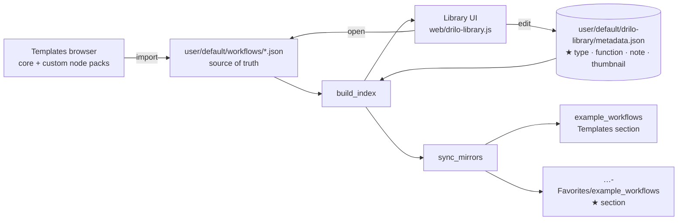

# 🐊 DRILO Workflow Library

**English** · [Español](README.es.md)

A ComfyUI custom node that contributes **no nodes**. It exists to make *choosing
which workflow to work on* a visual decision instead of a guess at a filename.


1. **A visual library**: a table with thumbnail, generation type, last used,
   function, required models and notes — filterable, sortable and editable
   in place. Open it from the ★ *Library* button in the sidebar rail, with
   `Ctrl+Shift+B`, or from the Workflow menu. `Ctrl+Shift+K` will **not** work:
   ComfyUI already binds it to `Workspace.ToggleBottomPanel.Shortcuts`.
2. **A section of your own in the Templates browser.** ComfyUI builds that menu
   by globbing `custom_nodes/*/example_workflows/*.json`, so this pack's
   `example_workflows` folder shows up as a section, and a sibling
   `…-Favorites` folder does the same for starred workflows.

## Install

Clone into `ComfyUI/custom_nodes/` and restart ComfyUI:

```bash
git clone https://github.com/cokedrilo/ComfyUI-DRILO-Workflow-Library
```

Requires Pillow, which ships with ComfyUI. On first run the pack creates a
sibling folder, `<install-folder>-Favorites`, which backs the ⭐ Templates
section — **that section only appears after the next restart**, because ComfyUI
registers custom node routes at startup.

> **Security note.** ComfyUI has no authentication. This pack adds endpoints
> that rename, duplicate, import and delete workflow files, so if you run
> ComfyUI with `--listen`, anyone who can reach the port can invoke them.
> Deleting moves files to a trash folder rather than unlinking them, but do not
> expose an unprotected instance to an untrusted network.

## Where your data lives

Nothing user-generated is stored inside this package — ComfyUI-Manager wipes
custom node folders when it updates them. Metadata, thumbnails and the trash
live in `user/default/drilo-library/`, next to your workflows. Data written by
earlier versions is migrated there automatically on first start.

## Data flow



Workflows are never edited through a copy: the library opens the real file, so
`Ctrl+S` saves over the original. Both `example_workflows` folders are
**regenerable mirrors** — they are wiped on every sync, so don't edit them.

## Columns

| Column | Notes |
| --- | --- |
| ★ | Starring also rebuilds the ⭐ Templates section |
| Image | Click to open · drop an image on it to set the thumbnail |
| Workflow | Editable — renames the real file. Cannot be hidden |
| Generation type | Inferred from the nodes, editable |
| Last used | Updated whenever you open the workflow from here |
| Runs | How many times it was actually executed, not merely opened |
| Function | Inferred (txt2img, inpaint, upscale…), editable |
| Models | Every model the graph references; missing ones in red |
| Comment | Free text |

## Row actions

| Action | What it does |
| --- | --- |
| Open | Loads the real workflow on the canvas |
| Duplicate | Creates `<name> copy.json`, cloning metadata and thumbnail |
| Delete | Moves the workflow to `trash/`, never unlinks it |

## Import from Templates

The *Import from Templates* button reads ComfyUI's own template index — both the
bundled ones and any contributed by installed custom node packs — and copies the
one you pick into your workflows folder, prefilling generation type and function
from its nodes and converting its preview into your row thumbnail.

## Missing models and nodes

Model filenames are collected from every widget value in the graph (including
subgraphs), so custom loaders are covered too, and checked against everything
`folder_paths` can resolve. Node types are checked in the **frontend** against
`LiteGraph.registered_node_types`, not against `NODE_CLASS_MAPPINGS`: packs like
KJNodes register some nodes (`GetNode`, `SetNode`) purely in JavaScript, and a
server-side check reports those as missing when they work fine.

The *⚠ Needs something* filter narrows the table to workflows you cannot run
as-is.

## Thumbnails

Three ways to set one: drop an image on the cell, click ✎ to pick from your
**recent outputs**, or upload a file. Whatever you give it is converted to a
640px JPEG, which is also what the Templates browser needs.

## Bulk actions

Tick the checkbox in the ★ column (or the one in the header to take everything
currently visible) and a bar appears with favorite, unfavorite, set generation
type and delete, applied to the whole selection in one request.

## Performance notes

The library does nothing while it is closed — no polling, no timers. The parts
that would otherwise grow with your collection are handled explicitly:

- Workflow JSONs are parsed only when their mtime changes; the analysis is
  cached in `metadata.json`.
- The Templates mirrors are synced **incrementally**. This runs on every star,
  rename, import and delete, and rewriting every file each time would be the
  single most expensive thing the pack does.
- The model catalogue is cached for 30 seconds: it grows with the size of your
  model library rather than with the number of workflows.
- Thumbnail URLs are versioned by file mtime so the browser caches them.
  A `Date.now()` token would refetch every thumbnail on every repaint —
  including on each keystroke in the search box.
- Row-height dragging writes one CSS custom property, not two style properties
  per row.

## Ordering

Click any header to sort by that column. To arrange the table by hand instead,
grab the **⠿** handle that appears in the ★ column and drop the row where you
want it: the table switches to manual order and remembers it. The *⠿ Manual
order* button returns to your arrangement after you have sorted by a column.

Manual order seeds itself from whatever you were looking at, so the first drag
does not reshuffle everything. Workflows added or imported later sit at the
bottom until you place them.

## Table settings

Column widths (drag the right edge of a header), row height (drag the bottom
edge in the ★ column), column visibility (right-click the headers, or the
*Columns* button) and the active sort are stored in `metadata.json` → `prefs`,
so they survive across sessions and browsers. Double-click a drag handle to
reset that value.

## Files

| Path | What it is |
| --- | --- |
| `library.py` | The `/drilo/*` API, index, metadata and mirrors |
| `web/drilo-library.js` | Frontend extension (table, filters, editing, import) |
| `user/default/drilo-library/metadata.json` | Editable metadata + `prefs`. Delete it to regenerate with inferred values |
| `user/default/drilo-library/thumbnails/` | One JPG per workflow |
| `user/default/drilo-library/trash/` | Workflows deleted from the table. Never emptied automatically |

## Design constraints worth knowing

- The Templates browser only recognises **`.jpg`** thumbnails sharing the JSON's
  basename; it ignores `.png` and `.webp`.
- The Templates section title is the **installed folder name**, so it follows
  whatever the repository is called.
- For a section's static route to be registered, the folder needs an
  `__init__.py` that imports cleanly. Without it the section is listed but
  every template 404s.
- Adding new workflows only needs a page reload; creating a **new section**
  requires restarting ComfyUI.
- Generation type is inferred with regexes, not bare substrings: a loose `wan`
  matched `PreviewAny` and mislabelled image workflows as video.

## License

MIT © Jorge Sarria (Cokedrilo)
